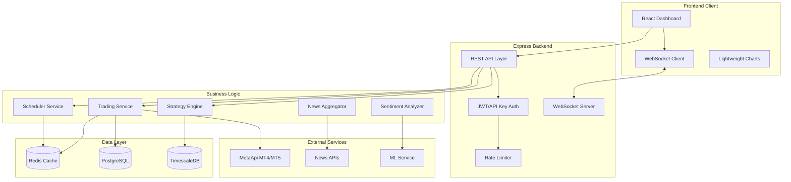
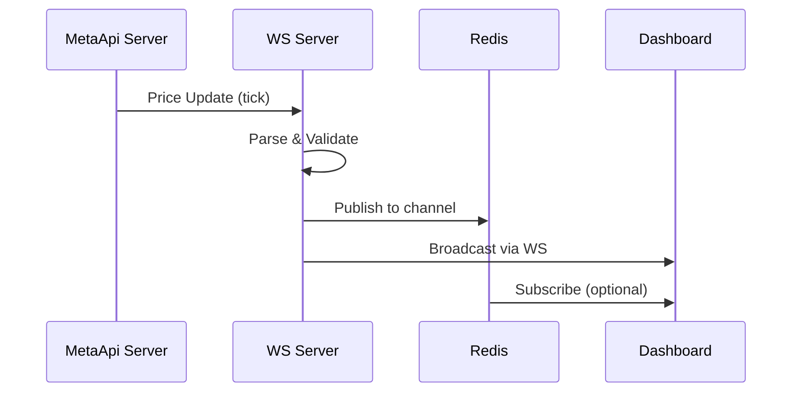
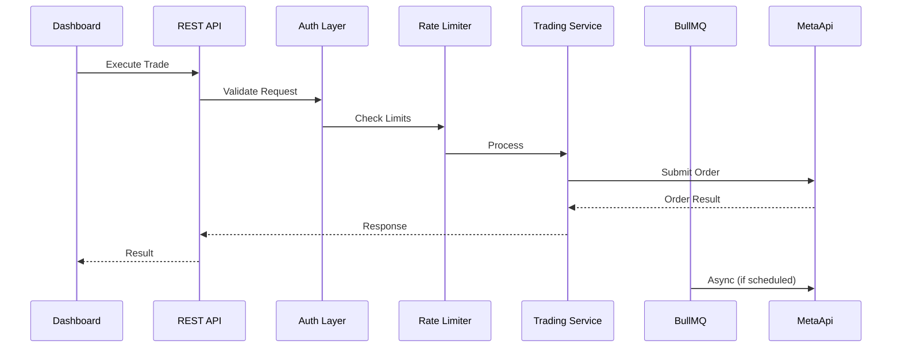
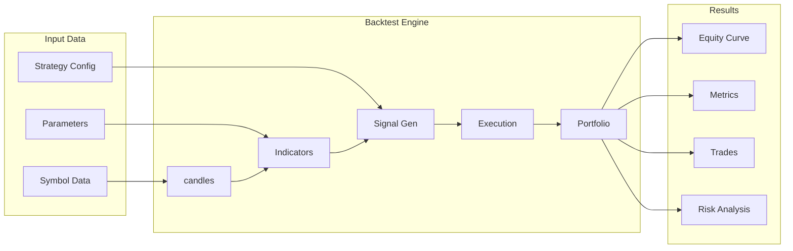

# AI Trading Station - Architecture Plan

## Executive Summary

Transform the existing MetaApi Trading Bot into a professional-grade AI Trading Station featuring real-time WebSocket price feeds, interactive candlestick charts with multiple timeframes, news automation with sentiment analysis, trading strategies with backtesting, automation features, and comprehensive analytics dashboard.

---

## 1. Current System Analysis

### 1.1 Existing Architecture

```
┌─────────────────────────────────────────────────────────────┐
│                     PRESENT STATE                            │
├─────────────────────────────────────────────────────────────┤
│  Frontend (public/index.html)                               │
│  ├── Vanilla JS + Lightweight-charts                        │
│  ├── Dark theme UI (Inter + JetBrains Mono fonts)          │
│  └── WebSocket client for real-time updates                 │
├─────────────────────────────────────────────────────────────┤
│  Backend (server.js)                                        │
│  ├── Express.js REST API                                    │
│  ├── MetaApi SDK (MT4/MT5)                                  │
│  ├── WebSocket Server (ws library)                          │
│  ├── Rate limiting & API key auth                           │
│  └── Journal system (in-memory)                             │
└─────────────────────────────────────────────────────────────┘
```

### 1.2 Current Features
- API key management with permissions
- Account connection to MetaApi
- Position & order tracking
- Market & pending orders
- Candlestick data retrieval
- Trading journal (in-memory)
- Real-time WebSocket price updates
- Rate limiting (60 req/min read, 10 req/min trade)

### 1.3 Identified Gaps
| Gap | Impact |
|-----|--------|
| No multi-timeframe charting | Limited technical analysis |
| No news integration | Missing fundamental analysis |
| No sentiment analysis | No AI-driven insights |
| No strategy backtesting | Can't validate trading strategies |
| No scheduled orders | Limited automation |
| No conditional orders | No event-driven trading |
| In-memory journal | No persistence |
| No analytics dashboard | Limited performance insights |

---

## 2. Target Architecture



---

## 3. Technology Stack

### 3.1 Frontend

| Component | Technology | Rationale |
|-----------|------------|-----------|
| Framework | **React 18** with TypeScript | Component architecture, type safety |
| State Management | **Zustand** | Lightweight, minimal boilerplate |
| Charts | **Lightweight-charts** + **TradingView Multi-Timeframe** | Professional trading charts |
| WebSocket | **Native WebSocket + Reconnection** | Real-time price feeds |
| UI Components | **Tailwind CSS** + **Radix UI** | Custom dark theme compatible |
| HTTP Client | **Axios** with interceptors | API communication |
| Date Handling | **date-fns** | Lightweight date utilities |
| Data Tables | **TanStack Table** | Performance for large datasets |

### 3.2 Backend

| Component | Technology | Rationale |
|-----------|------------|-----------|
| Runtime | **Node.js 20 LTS** | Current stable + async iterators |
| Framework | **Express.js** | Existing codebase compatibility |
| Language | **TypeScript** | Type safety, better DX |
| Validation | **Zod** | Runtime type validation |
| WebSocket | **ws** | Existing usage, high performance |
| Job Queue | **BullMQ + Redis** | Scheduled trades, conditional orders |
| ORM | **Prisma** | Type-safe database access |
| Cache | **Redis** | Real-time data, session store |

### 3.3 Data Layer

| Component | Technology | Rationale |
|-----------|------------|-----------|
| Primary DB | **PostgreSQL 16** | ACID, complex queries |
| Time-Series | **TimescaleDB** | Candlestick data, analytics |
| Cache | **Redis 7** | Real-time prices, sessions |
| Search | **Meilisearch** | News, journal search |

### 3.4 External Services

| Service | Purpose |
|---------|---------|
| MetaApi SDK | MT4/MT5 trading connectivity |
| Alpha Vantage | Stock/crypto price data |
| NewsAPI | Financial news aggregation |
| Finnhub | Market news & sentiment |
| OpenAI API | Sentiment analysis |

---

## 4. Module Architecture

### 4.1 Core Trading Module

```typescript
// services/trading/TradingService.ts
interface TradingService {
  // Connection Management
  connect(credentials: MetaApiCredentials): Promise<Connection>;
  disconnect(): Promise<void>;
  getConnectionStatus(): ConnectionStatus;

  // Market Data
  subscribeToPrice(symbol: string): Observable<PriceTick>;
  unsubscribeFromPrice(symbol: string): void;
  getHistoricalCandles(symbol: string, timeframe: Timeframe, count: number): Promise<Candle[]>;
  getCurrentPrice(symbol: string): Promise<Price>;

  // Order Management
  executeMarketOrder(order: MarketOrderRequest): Promise<OrderResult>;
  placePendingOrder(order: PendingOrderRequest): Promise<OrderResult>;
  cancelOrder(orderId: string): Promise<void>;
  closePosition(positionId: string, volume?: number): Promise<CloseResult>;
  closeAllPositions(): Promise<CloseResult[]>;

  // Account
  getAccountInfo(): Promise<AccountInfo>;
  getPositions(): Promise<Position[]>;
  getOrders(): Promise<PendingOrder[]>;
  getHistory(from: Date, to: Date): Promise<HistoryEntry[]>;
}
```

### 4.2 Strategy Engine Module

```typescript
// services/strategy/StrategyEngine.ts
interface StrategyEngine {
  // Strategy Management
  registerStrategy(strategy: TradingStrategy): string;
  unregisterStrategy(strategyId: string): void;
  getStrategy(strategyId: string): TradingStrategy | null;
  listStrategies(): StrategySummary[];

  // Strategy Definition
  addIndicator(indicator: IndicatorDefinition): void;
  addCondition(condition: ConditionDefinition): void;
  addAction(action: ActionDefinition): void;

  // Backtesting
  backtest(strategyId: string, params: BacktestParams): Promise<BacktestResult>;
  optimizeStrategy(strategyId: string, params: OptimizeParams): Promise<OptimizationResult>;

  // Live Execution
  startStrategy(strategyId: string): void;
  stopStrategy(strategyId: string): void;
  pauseStrategy(strategyId: string): void;
}

interface TradingStrategy {
  id: string;
  name: string;
  description: string;
  timeframe: Timeframe;
  symbols: string[];
  indicators: IndicatorInstance[];
  conditions: Condition[];
  actions: Action[];
  riskManagement: RiskRules;
  isActive: boolean;
}

interface BacktestParams {
  symbol: string;
  startDate: Date;
  endDate: Date;
  initialBalance: number;
  timeframe?: Timeframe;
  commission?: number;
  slippage?: number;
}
```

### 4.3 Scheduler Module

```typescript
// services/scheduler/SchedulerService.ts
interface SchedulerService {
  // Scheduled Trades
  scheduleTrade(schedule: TradeSchedule): string;
  cancelScheduledTrade(scheduleId: string): void;
  pauseScheduledTrade(scheduleId: string): void;
  resumeScheduledTrade(scheduleId: string): void;

  // Conditional Orders
  createConditionalOrder(condition: OrderCondition, action: OrderAction): string;
  cancelConditionalOrder(orderId: string): void;
  getConditionalOrders(): ConditionalOrder[];

  // Time-based Events
  scheduleEvent(cron: string, callback: () => void): string;
  cancelEvent(eventId: string): void;

  // Execution Queue
  getPendingExecutions(): ScheduledExecution[];
  getExecutionHistory(from: Date, to: Date): ExecutionResult[];
}

interface TradeSchedule {
  id?: string;
  symbol: string;
  type: 'market' | 'limit' | 'stop';
  side: 'buy' | 'sell';
  volume: number;
  price?: number; // for limit/stop
  scheduleTime: Date;
  timezone?: string;
  repeat?: {
    interval: number; // minutes
    until?: Date;
  } | null;
  enabled: boolean;
}

interface OrderCondition {
  id?: string;
  name: string;
  type: 'price_above' | 'price_below' | 'percent_change' | 'indicator_cross' | 'time';
  symbol: string;
  value: number;
  secondaryValue?: number; // for ranges
  indicatorId?: string;
  comparison?: 'gt' | 'lt' | 'eq' | 'cross_up' | 'cross_down';
}
```

### 4.4 News & Sentiment Module

```typescript
// services/news/NewsService.ts
interface NewsService {
  // News Aggregation
  getNews(params: NewsQuery): Promise<NewsArticle[]>;
  subscribeToNews(symbols: string[]): void;
  getNewsForSymbol(symbol: string, since?: Date): Promise<NewsArticle[]>;

  // Sentiment Analysis
  analyzeSentiment(text: string): Promise<SentimentResult>;
  analyzeSymbolSentiment(symbol: string): Promise<SymbolSentiment>;
  getSentimentHistory(symbol: string, from: Date, to: Date): Promise<SentimentHistory[]>;

  // Alerts
  createNewsAlert(alert: NewsAlert): string;
  getNewsAlerts(): NewsAlert[];
  deleteNewsAlert(alertId: string): void;
}

interface SentimentResult {
  score: number;        // -1 to 1
  label: 'positive' | 'negative' | 'neutral';
  confidence: number;   // 0 to 1
  keywords: string[];
  entities: Entity[];
}

interface SymbolSentiment {
  symbol: string;
  overallScore: number;
  positiveCount: number;
  negativeCount: number;
  neutralCount: number;
  articles: NewsArticle[];
  lastUpdated: Date;
}
```

---

## 5. Data Flow Architecture

### 5.1 Real-time Price Feed



### 5.2 Trade Execution Flow



### 5.3 Strategy Backtesting Flow



---

## 6. API Contract Design

### 6.1 REST Endpoints

```
Authentication:
POST   /api/v1/auth/login          - Login with credentials
POST   /api/v1/auth/refresh         - Refresh JWT token
POST   /api/v1/auth/logout          - Invalidate session

Account:
GET    /api/v1/account              - Get account info
GET    /api/v1/account/balance       - Get balance & equity
GET    /api/v1/account/positions     - Get open positions
GET    /api/v1/account/orders        - Get pending orders

Market Data:
GET    /api/v1/market/prices/:symbol       - Get current price
GET    /api/v1/market/candles/:symbol      - Get candles
GET    /api/v1/market/candles/:symbol/:tf  - Get candles by timeframe
GET    /api/v1/market/symbols              - Get available symbols
WS     /api/v1/market/stream               - WebSocket price stream

Trading:
POST   /api/v1/trade/market         - Execute market order
POST   /api/v1/trade/pending        - Place pending order
POST   /api/v1/trade/close/:id      - Close position
DELETE /api/v1/trade/order/:id      - Cancel pending order
POST   /api/v1/trade/close-all      - Close all positions

Strategies:
GET    /api/v1/strategies                 - List strategies
POST   /api/v1/strategies                 - Create strategy
GET    /api/v1/strategies/:id             - Get strategy details
PUT    /api/v1/strategies/:id             - Update strategy
DELETE /api/v1/strategies/:id             - Delete strategy
POST   /api/v1/strategies/:id/start       - Start strategy
POST   /api/v1/strategies/:id/stop        - Stop strategy
POST   /api/v1/strategies/:id/backtest    - Run backtest
GET    /api/v1/strategies/:id/results     - Get backtest results

Automation:
GET    /api/v1/scheduler/trades           - List scheduled trades
POST   /api/v1/scheduler/trades           - Schedule a trade
DELETE /api/v1/scheduler/trades/:id       - Cancel scheduled trade
GET    /api/v1/scheduler/conditions       - List conditional orders
POST   /api/v1/scheduler/conditions       - Create conditional order
DELETE /api/v1/scheduler/conditions/:id   - Delete conditional order

News:
GET    /api/v1/news                       - Get latest news
GET    /api/v1/news/symbol/:symbol        - Get news for symbol
GET    /api/v1/news/sentiment/:symbol     - Get sentiment for symbol
POST   /api/v1/news/alerts                - Create news alert
GET    /api/v1/news/alerts                - List news alerts

Analytics:
GET    /api/v1/analytics/overview         - Dashboard overview
GET    /api/v1/analytics/performance      - Performance metrics
GET    /api/v1/analytics/equity-curve     - Equity curve data
GET    /api/v1/analytics/risk             - Risk metrics
GET    /api/v1/analytics/trade-history    - Trade analysis

Journal:
GET    /api/v1/journal                    - List journal entries
POST   /api/v1/journal                    - Create entry
PUT    /api/v1/journal/:id                - Update entry
DELETE /api/v1/journal/:id                - Delete entry
GET    /api/v1/journal/stats              - Journal statistics
```

### 6.2 WebSocket Messages

```typescript
// Client -> Server
interface WSClientMessage {
  type: 'subscribe' | 'unsubscribe' | 'auth';
  payload: {
    channel?: 'prices' | 'positions' | 'orders' | 'trades' | 'news';
    symbols?: string[];
    token?: string;
  };
}

// Server -> Client
interface WSServerMessage {
  type: 'price' | 'position_update' | 'order_update' | 'trade_executed' | 'news' | 'alert' | 'heartbeat';
  payload: any;
  timestamp: number;
}

// Price Update Payload
interface PriceUpdate {
  symbol: string;
  bid: number;
  ask: number;
  last: number;
  change: number;
  changePercent: number;
  volume: number;
  timestamp: number;
}
```

---

## 7. Database Schema

### 7.1 PostgreSQL Schema

```sql
-- Users & Authentication
CREATE TABLE users (
    id UUID PRIMARY KEY DEFAULT gen_random_uuid(),
    email VARCHAR(255) UNIQUE NOT NULL,
    password_hash VARCHAR(255) NOT NULL,
    name VARCHAR(100),
    role VARCHAR(20) DEFAULT 'trader',
    api_key_hash VARCHAR(255),
    settings JSONB DEFAULT '{}',
    created_at TIMESTAMPTZ DEFAULT NOW(),
    updated_at TIMESTAMPTZ DEFAULT NOW()
);

-- Trading Accounts
CREATE TABLE trading_accounts (
    id UUID PRIMARY KEY DEFAULT gen_random_uuid(),
    user_id UUID REFERENCES users(id) ON DELETE CASCADE,
    name VARCHAR(100) NOT NULL,
    broker VARCHAR(50),
    account_type VARCHAR(20),
    metaapi_token_encrypted TEXT,
    metaapi_account_id VARCHAR(255),
    is_active BOOLEAN DEFAULT true,
    settings JSONB DEFAULT '{}',
    created_at TIMESTAMPTZ DEFAULT NOW(),
    updated_at TIMESTAMPTZ DEFAULT NOW()
);

-- Strategies
CREATE TABLE strategies (
    id UUID PRIMARY KEY DEFAULT gen_random_uuid(),
    user_id UUID REFERENCES users(id) ON DELETE CASCADE,
    name VARCHAR(100) NOT NULL,
    description TEXT,
    definition JSONB NOT NULL,
    timeframe VARCHAR(10),
    symbols TEXT[],
    is_active BOOLEAN DEFAULT false,
    last_run TIMESTAMPTZ,
    created_at TIMESTAMPTZ DEFAULT NOW(),
    updated_at TIMESTAMPTZ DEFAULT NOW()
);

-- Scheduled Trades
CREATE TABLE scheduled_trades (
    id UUID PRIMARY KEY DEFAULT gen_random_uuid(),
    user_id UUID REFERENCES users(id) ON DELETE CASCADE,
    account_id UUID REFERENCES trading_accounts(id),
    symbol VARCHAR(20) NOT NULL,
    type VARCHAR(10) NOT NULL,
    side VARCHAR(5) NOT NULL,
    volume DECIMAL(10, 5) NOT NULL,
    price DECIMAL(15, 5),
    schedule_time TIMESTAMPTZ NOT NULL,
    repeat_interval INTEGER,
    repeat_until TIMESTAMPTZ,
    enabled BOOLEAN DEFAULT true,
    status VARCHAR(20) DEFAULT 'pending',
    created_at TIMESTAMPTZ DEFAULT NOW(),
    updated_at TIMESTAMPTZ DEFAULT NOW()
);

-- Conditional Orders
CREATE TABLE conditional_orders (
    id UUID PRIMARY KEY DEFAULT gen_random_uuid(),
    user_id UUID REFERENCES users(id) ON DELETE CASCADE,
    account_id UUID REFERENCES trading_accounts(id),
    name VARCHAR(100),
    condition JSONB NOT NULL,
    action JSONB NOT NULL,
    triggered_at TIMESTAMPTZ,
    executed_at TIMESTAMPTZ,
    status VARCHAR(20) DEFAULT 'active',
    created_at TIMESTAMPTZ DEFAULT NOW(),
    updated_at TIMESTAMPTZ DEFAULT NOW()
);

-- News & Sentiment
CREATE TABLE news_articles (
    id UUID PRIMARY KEY DEFAULT gen_random_uuid(),
    source VARCHAR(100),
    title VARCHAR(500) NOT NULL,
    summary TEXT,
    url TEXT,
    image_url TEXT,
    published_at TIMESTAMPTZ NOT NULL,
    sentiment_score DECIMAL(5, 4),
    sentiment_label VARCHAR(20),
    symbols TEXT[],
    created_at TIMESTAMPTZ DEFAULT NOW()
);

CREATE TABLE symbol_sentiment (
    id UUID PRIMARY KEY DEFAULT gen_random_uuid(),
    symbol VARCHAR(20) NOT NULL,
    date DATE NOT NULL,
    avg_sentiment DECIMAL(5, 4),
    article_count INTEGER,
    positive_count INTEGER,
    negative_count INTEGER,
    neutral_count INTEGER,
    UNIQUE(symbol, date)
);

-- Journal
CREATE TABLE journal_entries (
    id UUID PRIMARY KEY DEFAULT gen_random_uuid(),
    user_id UUID REFERENCES users(id) ON DELETE CASCADE,
    trade_date DATE NOT NULL,
    symbol VARCHAR(20),
    trade_type VARCHAR(10),
    side VARCHAR(5),
    volume DECIMAL(10, 5),
    entry_price DECIMAL(15, 5),
    exit_price DECIMAL(15, 5),
    pnl DECIMAL(15, 5),
    pnl_percent DECIMAL(8, 4),
    setup VARCHAR(50),
    emotion VARCHAR(20),
    notes TEXT,
    tags TEXT[],
    screenshot_url TEXT,
    created_at TIMESTAMPTZ DEFAULT NOW(),
    updated_at TIMESTAMPTZ DEFAULT NOW()
);

-- Backtest Results
CREATE TABLE backtest_results (
    id UUID PRIMARY KEY DEFAULT gen_random_uuid(),
    strategy_id UUID REFERENCES strategies(id) ON DELETE CASCADE,
    started_at TIMESTAMPTZ NOT NULL,
    completed_at TIMESTAMPTZ,
    symbol VARCHAR(20) NOT NULL,
    timeframe VARCHAR(10),
    initial_balance DECIMAL(15, 5),
    final_balance DECIMAL(15, 5),
    total_trades INTEGER,
    winning_trades INTEGER,
    losing_trades INTEGER,
    win_rate DECIMAL(5, 4),
    profit_factor DECIMAL(8, 4),
    max_drawdown DECIMAL(8, 4),
    sharpe_ratio DECIMAL(8, 4),
    results_data JSONB,
    status VARCHAR(20) DEFAULT 'running'
);
```

### 7.2 TimescaleDB Schema (Time-Series)

```sql
-- Must be created as TimescaleDB hypertable
CREATE TABLE price_candles (
    time TIMESTAMPTZ NOT NULL,
    symbol VARCHAR(20) NOT NULL,
    timeframe VARCHAR(10) NOT NULL,
    open DECIMAL(15, 5) NOT NULL,
    high DECIMAL(15, 5) NOT NULL,
    low DECIMAL(15, 5) NOT NULL,
    close DECIMAL(15, 5) NOT NULL,
    volume DECIMAL(15, 5),
    tick_volume INTEGER,
    spread DECIMAL(10, 5),
    PRIMARY KEY(time, symbol, timeframe)
);

SELECT create_hypertable('price_candles', 'time', chunk_time_interval => INTERVAL '1 day');

-- Price ticks (high-frequency)
CREATE TABLE price_ticks (
    time TIMESTAMPTZ NOT NULL,
    symbol VARCHAR(20) NOT NULL,
    bid DECIMAL(15, 5),
    ask DECIMAL(15, 5),
    last DECIMAL(15, 5),
    volume DECIMAL(15, 5),
    PRIMARY KEY(time, symbol)
);

SELECT create_hypertable('price_ticks', 'time', chunk_time_interval => INTERVAL '1 hour');

-- Equity tracking
CREATE TABLE equity_history (
    time TIMESTAMPTZ NOT NULL,
    account_id UUID NOT NULL,
    balance DECIMAL(15, 5) NOT NULL,
    equity DECIMAL(15, 5) NOT NULL,
    margin DECIMAL(15, 5),
    free_margin DECIMAL(15, 5),
    margin_level DECIMAL(10, 2),
    open_positions INTEGER,
    PRIMARY KEY(time, account_id)
);

SELECT create_hypertable('equity_history', 'time', chunk_time_interval => INTERVAL '1 hour');

-- Continuous aggregate for daily OHLC
CREATE MATERIALIZED VIEW daily_candles
WITH (timescaledb.continuous) AS
SELECT
    timeframe,
    symbol,
    time_bucket('1 day', time) AS bucket,
    FIRST(open, time) AS open,
    MAX(high) AS high,
    MIN(low) AS low,
    LAST(close, time) AS close,
    SUM(volume) AS volume
FROM price_candles
GROUP BY timeframe, symbol, bucket;
```

---

## 8. Component Structure (Frontend)

### 8.1 React Component Hierarchy

```
src/
├── components/
│   ├── layout/
│   │   ├── Sidebar/
│   │   ├── TopBar/
│   │   ├── StatusBar/
│   │   └── Layout.tsx
│   ├── charts/
│   │   ├── CandlestickChart/
│   │   ├── VolumeChart/
│   │   ├── TimeframeSelector/
│   │   ├── ChartToolbar/
│   │   └── Chart.tsx
│   ├── trading/
│   │   ├── OrderForm/
│   │   ├── PositionsList/
│   │   ├── OrdersList/
│   │   ├── TradeTicket/
│   │   └── QuickTrade.tsx
│   ├── strategies/
│   │   ├── StrategyList/
│   │   ├── StrategyBuilder/
│   │   ├── IndicatorConfig/
│   │   ├── ConditionBuilder/
│   │   └── BacktestResults/
│   ├── automation/
│   │   ├── Scheduler/
│   │   ├── ConditionalOrders/
│   │   ├── CronBuilder/
│   │   └── AutomationList.tsx
│   ├── news/
│   │   ├── NewsFeed/
│   │   ├── SentimentGauge/
│   │   ├── NewsCard/
│   │   └── NewsAlertConfig.tsx
│   ├── analytics/
│   │   ├── Dashboard/
│   │   ├── EquityCurve/
│   │   ├── PerformanceMetrics/
│   │   ├── TradeAnalysis/
│   │   ├── RiskMetrics/
│   │   └── CalendarHeatmap.tsx
│   └── common/
│       ├── Button/
│       ├── Input/
│       ├── Select/
│       ├── Modal/
│       ├── Table/
│       ├── Badge/
│       └── Loading/
├── hooks/
│   ├── useWebSocket.ts
│   ├── useMarketData.ts
│   ├── useTrading.ts
│   ├── useStrategies.ts
│   ├── useScheduler.ts
│   └── useAuth.ts
├── stores/
│   ├── marketStore.ts
│   ├── tradingStore.ts
│   ├── strategyStore.ts
│   ├── schedulerStore.ts
│   ├── newsStore.ts
│   └── uiStore.ts
├── services/
│   ├── api.ts
│   ├── websocket.ts
│   └── technicalAnalysis.ts
├── utils/
│   ├── formatters.ts
│   ├── validators.ts
│   └── calculations.ts
└── types/
    ├── market.ts
    ├── trading.ts
    ├── strategy.ts
    └── news.ts
```

### 8.2 State Management (Zustand)

```typescript
// stores/marketStore.ts
interface MarketState {
  prices: Record<string, PriceData>;
  candles: Record<string, CandleData[]>;
  selectedSymbol: string;
  selectedTimeframe: Timeframe;
  subscriptions: Set<string>;

  // Actions
  setPrice: (symbol: string, price: PriceData) => void;
  setCandles: (symbol: string, candles: CandleData[]) => void;
  addCandle: (symbol: string, candle: CandleData) => void;
  setSelectedSymbol: (symbol: string) => void;
  setSelectedTimeframe: (tf: Timeframe) => void;
  subscribe: (symbol: string) => void;
  unsubscribe: (symbol: string) => void;
}

// stores/tradingStore.ts
interface TradingState {
  positions: Position[];
  orders: PendingOrder[];
  isLoading: boolean;
  error: string | null;

  // Actions
  fetchPositions: () => Promise<void>;
  fetchOrders: () => Promise<void>;
  executeMarketOrder: (order: MarketOrderRequest) => Promise<OrderResult>;
  placePendingOrder: (order: PendingOrderRequest) => Promise<OrderResult>;
  closePosition: (id: string) => Promise<void>;
  cancelOrder: (id: string) => Promise<void>;
}
```

---

## 9. Implementation Phases

### Phase 1: Foundation (Weeks 1-2)
- [ ] Migrate server.js to TypeScript
- [ ] Setup PostgreSQL with Prisma
- [ ] Implement JWT authentication
- [ ] Create REST API v1 structure
- [ ] Setup Redis for caching
- [ ] Migrate frontend to React + TypeScript

### Phase 2: Real-time Infrastructure (Weeks 3-4)
- [ ] Implement WebSocket server with reconnection
- [ ] Create price subscription system
- [ ] Setup TimescaleDB for candlestick data
- [ ] Implement real-time chart component
- [ ] Add multiple timeframe support
- [ ] Create price alert system

### Phase 3: Trading Module (Weeks 5-6)
- [ ] Implement full trading service
- [ ] Create order management UI
- [ ] Add position tracking dashboard
- [ ] Implement trade confirmation flows
- [ ] Add risk management warnings
- [ ] Create trading journal with persistence

### Phase 4: Strategy Engine (Weeks 7-8)
- [ ] Design strategy definition schema
- [ ] Implement indicator library (SMA, EMA, RSI, MACD, Bollinger)
- [ ] Create condition builder UI
- [ ] Build backtesting engine
- [ ] Implement strategy optimization
- [ ] Add strategy performance metrics

### Phase 5: Automation (Weeks 9-10)
- [ ] Setup BullMQ job queue
- [ ] Implement scheduled trade execution
- [ ] Create conditional order system
- [ ] Build automation dashboard
- [ ] Add cron-based scheduling UI
- [ ] Implement order condition triggers

### Phase 6: News & Sentiment (Weeks 11-12)
- [ ] Integrate news aggregation APIs
- [ ] Implement sentiment analysis service
- [ ] Create news feed UI
- [ ] Add symbol-specific sentiment
- [ ] Build news alerts system
- [ ] Integrate sentiment into strategy conditions

### Phase 7: Analytics Dashboard (Weeks 13-14)
- [ ] Create performance metrics calculations
- [ ] Build equity curve visualization
- [ ] Implement trade analysis tools
- [ ] Add risk metrics (Sharpe, Drawdown, VaR)
- [ ] Create export functionality
- [ ] Build custom date range reports

### Phase 8: Polish & Integration (Weeks 15-16)
- [ ] Optimize WebSocket message handling
- [ ] Implement data compression
- [ ] Add offline support with service worker
- [ ] Create mobile-responsive layouts
- [ ] Add keyboard shortcuts
- [ ] Performance testing and optimization

---

## 10. Key Technical Decisions

### 10.1 WebSocket Architecture
- Single WebSocket connection per client
- Channel-based subscriptions (prices, positions, orders, news)
- Message compression for large payloads
- Automatic reconnection with exponential backoff
- Heartbeat every 30 seconds

### 10.2 Data Refresh Strategy
| Data Type | Refresh Rate | Method |
|-----------|--------------|--------|
| Live Prices | Real-time | WebSocket |
| Candles | On visible range change | REST |
| Positions | 5 seconds | REST + WebSocket |
| Orders | 5 seconds | REST + WebSocket |
| News | 1 minute | REST polling |
| Sentiment | 5 minutes | Cached + REST |

### 10.3 Security Measures
- JWT tokens with 1-hour expiry + refresh tokens
- API key support for programmatic access
- Rate limiting per endpoint tier
- Input validation with Zod
- SQL injection prevention via Prisma
- XSS prevention in React
- CORS configuration for allowed origins
- WebSocket authentication on connect

### 10.4 Performance Targets
- WebSocket message latency: < 50ms
- Chart render time: < 100ms for 10,000 candles
- API response time: < 200ms (95th percentile)
- Backtest 1 year data: < 30 seconds
- Initial page load: < 2 seconds

---

## 11. File Structure

```
ai-trading-station/
├── client/                         # React Frontend
│   ├── public/
│   │   └── index.html
│   ├── src/
│   │   ├── components/
│   │   ├── hooks/
│   │   ├── stores/
│   │   ├── services/
│   │   ├── types/
│   │   ├── utils/
│   │   ├── styles/
│   │   ├── App.tsx
│   │   └── main.tsx
│   ├── package.json
│   ├── tsconfig.json
│   ├── vite.config.ts
│   └── tailwind.config.js
│
├── server/                         # Express Backend
│   ├── src/
│   │   ├── config/
│   │   │   ├── database.ts
│   │   │   ├── redis.ts
│   │   │   └── env.ts
│   │   ├── middleware/
│   │   │   ├── auth.ts
│   │   │   ├── rateLimit.ts
│   │   │   ├── validation.ts
│   │   │   └── errorHandler.ts
│   │   ├── routes/
│   │   │   ├── v1/
│   │   │   │   ├── auth.ts
│   │   │   │   ├── market.ts
│   │   │   │   ├── trading.ts
│   │   │   │   ├── strategies.ts
│   │   │   │   ├── scheduler.ts
│   │   │   │   ├── news.ts
│   │   │   │   ├── analytics.ts
│   │   │   │   └── journal.ts
│   │   │   └── index.ts
│   │   ├── services/
│   │   │   ├── trading/
│   │   │   │   ├── TradingService.ts
│   │   │   │   ├── MarketDataService.ts
│   │   │   │   └── MetaApiAdapter.ts
│   │   │   ├── strategy/
│   │   │   │   ├── StrategyEngine.ts
│   │   │   │   ├── indicators/
│   │   │   │   ├── backtesting/
│   │   │   │   └── optimizer/
│   │   │   ├── scheduler/
│   │   │   │   ├── SchedulerService.ts
│   │   │   │   ├── ConditionalOrderService.ts
│   │   │   │   └── JobQueue.ts
│   │   │   ├── news/
│   │   │   │   ├── NewsAggregator.ts
│   │   │   │   └── SentimentAnalyzer.ts
│   │   │   └── websocket/
│   │   │       ├── WebSocketServer.ts
│   │   │       └── MessageHandler.ts
│   │   ├── models/
│   │   │   └── prisma/
│   │   │       └── schema.prisma
│   │   ├── utils/
│   │   ├── types/
│   │   └── index.ts
│   ├── package.json
│   └── tsconfig.json
│
├── shared/                         # Shared Types
│   ├── types/
│   │   ├── market.ts
│   │   ├── trading.ts
│   │   ├── strategy.ts
│   │   └── api.ts
│   └── package.json
│
├── docker-compose.yml
├── .env.example
├── package.json                    # Root workspace
└── README.md
```

---

## 12. Dependencies Summary

### Frontend Dependencies
```json
{
  "react": "^18.2.0",
  "react-dom": "^18.2.0",
  "typescript": "^5.3.0",
  "zustand": "^4.4.0",
  "lightweight-charts": "^4.1.0",
  "@tanstack/react-table": "^8.10.0",
  "date-fns": "^2.30.0",
  "axios": "^1.6.0",
  "zod": "^3.22.0",
  "@radix-ui/react-dialog": "^1.0.5",
  "@radix-ui/react-dropdown-menu": "^2.0.6",
  "@radix-ui/react-select": "^2.0.0",
  "@radix-ui/react-switch": "^1.0.3",
  "tailwindcss": "^3.3.0",
  "@vitejs/plugin-react": "^4.2.0",
  "vite": "^5.0.0"
}
```

### Backend Dependencies
```json
{
  "express": "^4.18.2",
  "typescript": "^5.3.0",
  "ws": "^8.16.0",
  "@prisma/client": "^5.7.0",
  "prisma": "^5.7.0",
  "ioredis": "^5.3.0",
  "bullmq": "^4.14.0",
  "zod": "^3.22.0",
  "jsonwebtoken": "^9.0.2",
  "bcryptjs": "^2.4.3",
  "cors": "^2.8.5",
  "dotenv": "^16.3.1",
  "express-rate-limit": "^7.1.0",
  "compression": "^1.7.4",
  "helmet": "^7.1.0",
  "node-cron": "^3.0.3",
  "trading-indicators": "^2.0.0"
}
```

---

## 13. Risk Mitigation

| Risk | Probability | Impact | Mitigation |
|------|-------------|--------|------------|
| MetaApi rate limits | Medium | High | Implement local caching, batch requests |
| WebSocket connection drops | High | Medium | Auto-reconnect with backoff, queue updates |
| Large backtest memory usage | Medium | Medium | Stream processing, chunked execution |
| News API rate limits | Medium | Low | Multiple API providers, aggressive caching |
| Database performance at scale | Low | High | TimescaleDB compression, proper indexing |
| Real-time chart performance | High | Medium | Canvas rendering, virtualization |

---

## 14. Open Questions for User

1. **Data Persistence**: Should all historical price data be stored locally, or rely on MetaApi for historical requests?

2. **Strategy Complexity**: Should the strategy builder support visual/no-code strategy creation, or focus on code-based strategies for power users?

3. **Multi-Account**: Is multi-account management needed (trading across multiple MetaApi accounts)?

4. **Cloud Deployment**: Target deployment platform (AWS, GCP, DigitalOcean, Render)?

5. **Mobile Support**: Prioritize mobile-responsive design or focus on desktop-first?

6. **Copy Trading**: Include social/copy trading features in scope?
